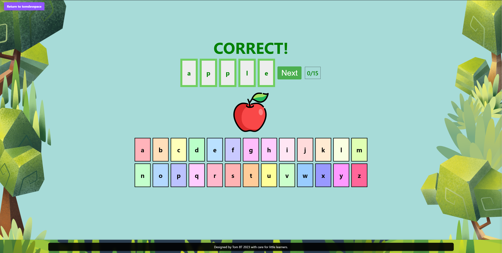
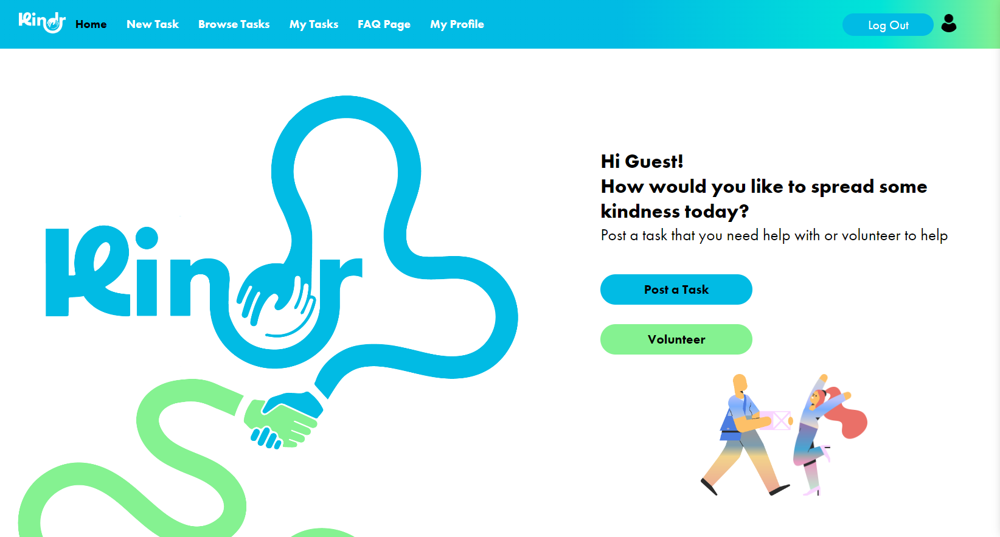

<!DOCTYPE html>
<html lang="en">
<head>
  <meta charset="UTF-8">
  <link rel="stylesheet" href="styles.css">
</head>
<body>

# Recent Projects

## My React Portfolio

One of my most recent projects is my portfolio website. It's an ongoing project, but I'm happy with the progress so far. Below, you'll find links to my repository and the live site.

- **Repository:** [GitHub - React Portfolio](https://github.com/Tomuos/React-Portfolio)
- **Live Site:** [tomdevspace](https://tomdevspace.netlify.app/)

---

## Word Games Collection

I've consolidated various word games into a single repository. Each game has its own README, but I've included their descriptions here for convenience.

- **Repository:**: [GitHub - Word Games Collection](https://github.com/Tomuos/word-games)

### Phonics Memory Game

**Description:** "Phonics Memory Game" combines memory challenges with phonetic spellings. Players match phonetically similar words, enhancing both memory and linguistic skills.

**Gameplay Highlights:**
- Match phonetic spellings of words with similar sounds.
- Designed to improve phonetic understanding through engaging gameplay.

### Word Constructor

**Live Link:** [Word Constructor](https://word-constructor.netlify.app/)

**Description:** "Word Constructor" is a dynamic word puzzle game where players align phonetic sounds with correct spellings, challenging users to spell words accurately.

**Game Insights:**
- Drag and drop letters to spell words correctly.
- The game is designed to bridge the gap between phonetic sounds and spelling.

---

## Kindr - A Community-Driven App

Developed with a wonderful team at the School of Code, Kindr focuses on fostering community support to combat anxiety and loneliness. Here's a brief overview of our project and its goals.

- **Live Site:** [Kindr](https://kindr.netlify.app/)
- **Repository:** [GitHub - Kindr](https://github.com/jsonandthearguments/kindr)

**Project Summary:**
Kindr is designed to encourage altruistic actions, offering features for task posting and volunteering. We utilized tools like Trello and FigJam for project management, aiming to add a user rating system, smarter filtering options, and a chat feature to enhance community interaction.

Our teamwork and agile methodologies were crucial in developing Kindr, emphasizing the importance of collaboration in creating meaningful digital spaces.

---

# Other events

## Binance x School of Code Talk

The team and I had another experience in August 2023 where I was invited to take part in a talk between The School of Code and Binance. Oh Hey look I've provided that video here too

---
A brief summary 

- Binance charity partnered with the School of Code
- We were invited to chat with them about what it's like getting into the school of code, what we learned and how they helped us gain confidence 
- You will see demos for apps made by the Kindr team and 8Bit

---

## If you are trying to track down group members:

<table align="center">
  <tr>
    <!-- Naomi Profile -->
    <td valign="top" width="20%">
      

        
         
        GitHub: <a href="https://github.com/naomicrisp">naomicrisp</a> 
        LinkedIn: <a href="https://www.linkedin.com/in/naomi-crisp/">Naomi Crisp</a>
      

    </td>    
    <!-- Paul Profile -->
    <td valign="top" width="20%">
      

        
         
        GitHub: <a href="https://github.com/percygr">percygr</a> 
        LinkedIn: <a href="https://www.linkedin.com/in/paul-greenfield/">Paul Greenfield</a>
      

    </td>    
    <!-- Christian Profile -->
    <td valign="top" width="20%">
      

        
         
        GitHub: <a href="https://github.com/lastcastleofbowser">lastcastleofbowser</a> 
        LinkedIn: <a href="https://www.linkedin.com/in/christianwillcox/">Christian Wilcox</a>
      

    </td>    
    <!-- Bryony Profile -->
    <td valign="top" width="20%">
      

        
         
        GitHub: <a href="https://github.com/bryonyShep">bryonyShep</a> 
        LinkedIn: <a href="https://www.linkedin.com/in/bryony-shepherd-124700150/">Bryony Shepherd</a>
      

    </td>    
    <!-- James Profile -->
    <td valign="top" width="20%">
      

        
         
        GitHub: <a href="https://github.com/attrill20">attrill20</a> 
        LinkedIn: <a href="https://www.linkedin.com/in/james-codes/">James Attrill</a>
      

    </td>
  </tr>
</table>

## You're still here?

https://github.com/Tomuos/Tomuos/assets/110429174/893406ec-b380-4da7-a821-d5b45548fa25

## I'm only joking, Thanks for visiting  👍
